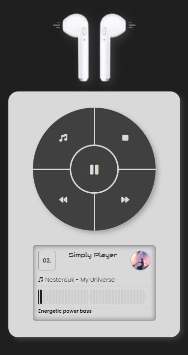

# Frontend Mentor - Age calculator app solution

This is a solution to the .

## Table of contents

- [Overview](#overview)
  - [The challenge](#the-challenge)
  - [Screenshot](#screenshot)
  - [Links](#links)
- [My process](#my-process)
  - [Built with](#built-with)
  - [What I Learned](#what-i-learned)
- [Author](#author)

## Overview

### The challenge

### Screenshot

### Links

- Solution URL: [GitHub](https://github.com/andre1dragos/simply_player.git)
- Live Site URL: [Live](https://andre1dragos.github.io/simply_player/)

### Built with

- Semantic HTML5 markup
- CSS custom properties
- Flexbox
- CSS Grid
- Modern Javascript
- Wavesurfer.js library
- Mobile-first workflow
- Dry principle

### What I learned

- Wavesurfer.js library

## Author

- GitHub - [Dragos Andrei](https://github.com/andre1dragos)
- Frontend Mentor - [Dragos Andrei](https://www.frontendmentor.io/profile/andre1dragos)
